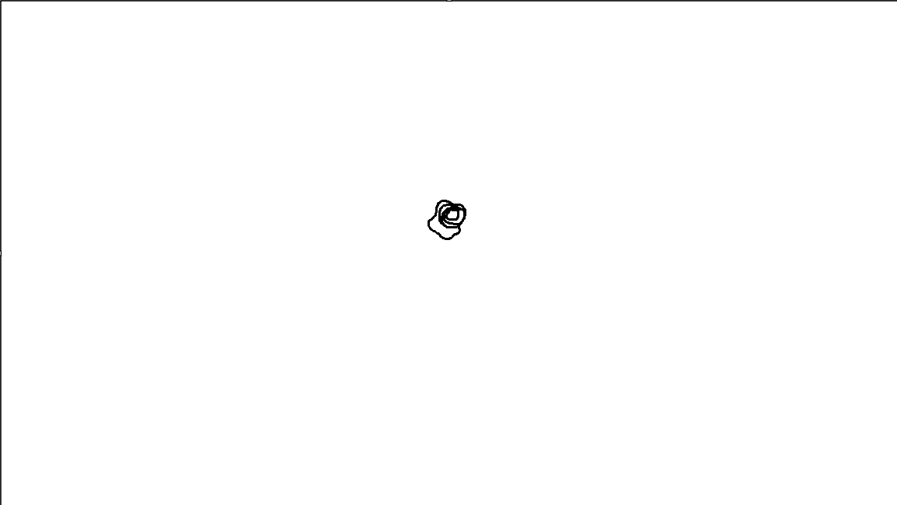
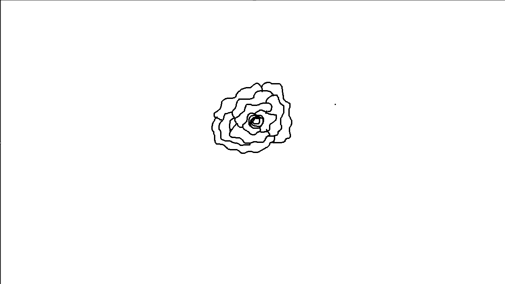
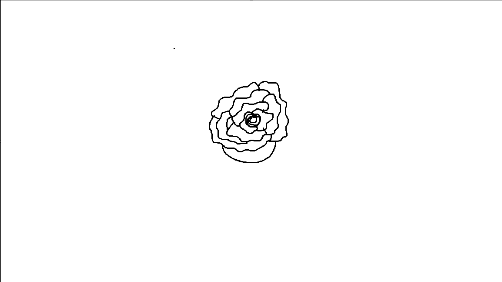
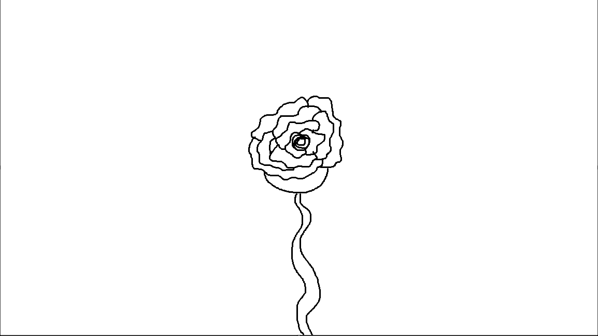
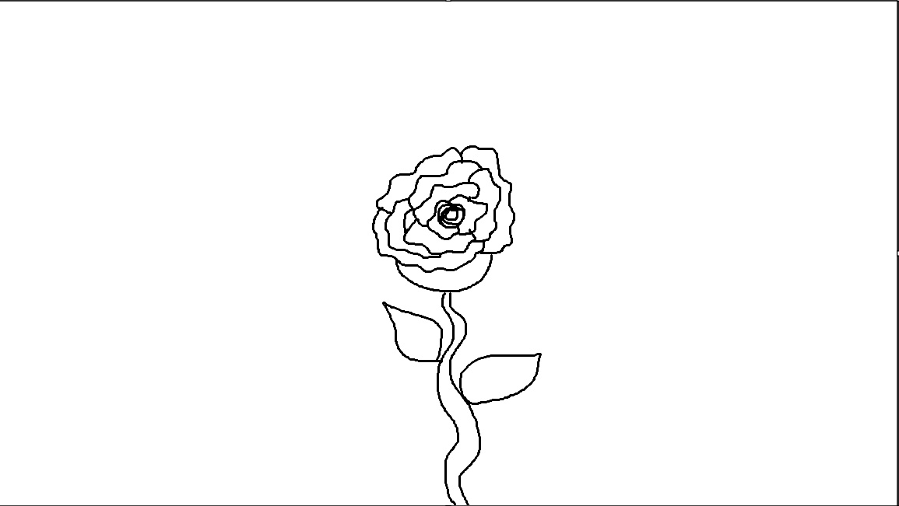
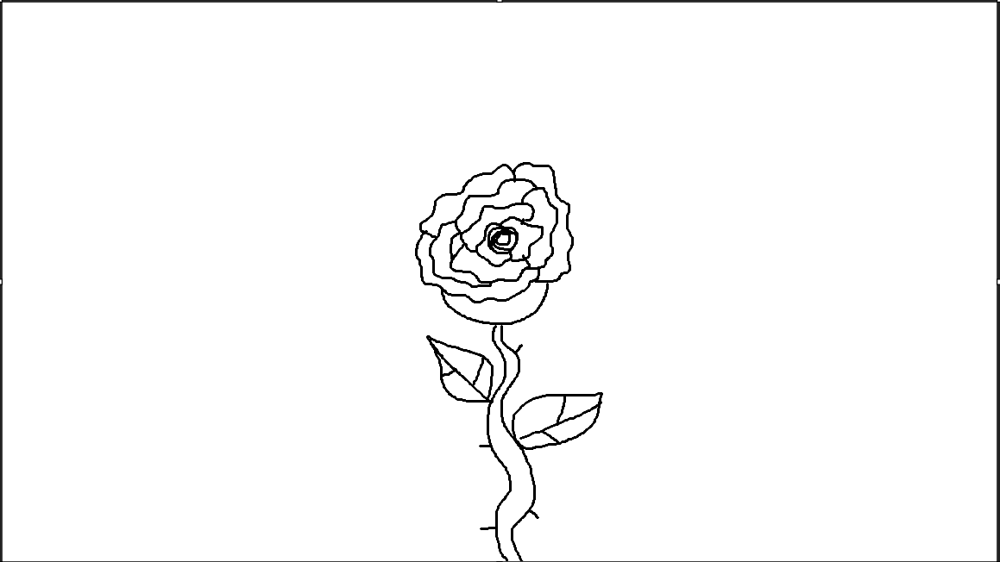

# Instructions: How to Restring a Concert Xylophone with a Broken Cord

<h3>Removing the Old Cord</h3>
  
1. Get your supplies: a pair of scissors, a paper clip, a lighter, and around 50 feet of 1/8" bungee cord. The amount of cord you need will vary based on how many keys your xylophone has and the width of each key, but generally a concert xylophone has ~42 keys each 1-1.5 inches in width, so that would be ~25 feet of cord. I usually opt for extra.  
[Source: https://www.amazon.com/dp/B0C5JNGKMH/ref=sspa_dk_detail_6]  

  
2. Walking around your xylophone, locate which side has been previously tied. This side will typically have small metal springs that can be easily rolled off.  
[Source: https://music.colostate.edu/percussion-ensembles/adams-concert-xylophone/]  

3. Cut the cord on this side near the tie.  
4. Go to the opposite end of the xylophone. This side should look like a piece of rope looped into two small metal holes.  
5. Begin to pull the cord out from this side. This will likely take a while. If the string gets caught on a key, pick up the key and pull out the string straight from that hole before returning to the side.  
6. Now that the broken string has been removed, ensure all keys are still placed in their original positions to make restringing easier, return to the side the tie originally was.  

<h3>Preparing the Cord</h3>
7. Flatten the paper clip out into a small metal rod, ensuring it's longer than the width of each key.  
  
8. Form half of the paper clip into a small aberdeen fish hook like noted above. It has to be thin enough to fit in the small holes on the keys and the metal loops on the instrument.  
[Source: https://gamakatsu.com/product/aberdeen-hooks/]  
9. Burn the loose end of the bungee cord to fuse the strings together.  
10. Hook the burnt end on the bungee cord through your paperclip hook. You should now have a relatively sturdy thredding device.  

<h3>Restringing</h3>
11. On the end you originally had the knot, slightly lift the key closest to you.  
12. Thread the bungee cord through the top small metal loop on the bar.  
13. Thread the bungee cord through the hole found on the top half of the key.  
14. Thread the bungee cord through the next metal loop before placing down the bar.  
15. Repeat steps 11-14 for every bar until you reach the end of the instrument.  
16. Once at the end, repeat steps 11-15, this time on the end you had the loop and going through the bottom loop and hole on the lower half of the keys.  
17. When you get back to the end you originally had tied, tightly tie the hooked end of the bungee cord to the string sticking out of the first key strung.  
18. If your tie originally had metal springs on it, place those back on.  
17. Repeat steps 9-18 for the bottom row of keys.  

# Revised Instructions: How to Draw A Rose

Figure 1. A small circle on a blank canvas.

(Source: Vanessa Roberts)

Step 1. Draw a small circle in the center of the canvas.
   

Figure 2. A spiral has been added to the previous circle.

(Source: Vanessa Roberts)

2. Starting from any point on the circle's perimeter, <b>draw a small spiral looping around the circle.</b>
   

3. <b>Connect the spiral to itself to form another outer circle surrounding the original inner circle</b> to form the base of the rose.
    

Figure 3. A squiggly line petal has been added to the rose.

(Source: Vanessa Roberts)

4. Beginning from any point on the outer circle's perimeter, <b>draw a small squiggly line coming out of the circle.</b>
   

5. <b>Connect the squiggly line back to any other point on the outer circle's perimeter.</b> This is how you create the petals.
    

Figure 4. Multiple more petals have been added to the rose.

(Source: Vanessa Roberts)

6. <b>Repeat steps 4 and 5 to continue drawing petals, making them increasingly longer lengths.</b> Continue until you're satisfied with the size of your rose.
   

Figure 5. A small semicircle is now connected to the bottom of the rose.

(Source: Vanessa Roberts)

7. At the bottom of your petals, <b>draw a semicircle.</b> This will be where the petals connect to the stem.
   

Figure 6. A stem reaching from the bottom of the semicircle to the bottom of the canvas has been added to the rose.

(Source: Vanessa Roberts)

8. Starting from the middle of the semicircle's perimeter, <b>draw a squiggly line straight down to the bottom of the canvas.</b>
    

9. Next to the previously added squiggly line, <b>draw another squiggly line going straight down to the bottom of the canvas</b> to give them stem width.
   

Figure 7. Two small leaves have been added to the stem of the rose.

(Source: Vanessa Roberts)

10. At any points on the stem, <b>draw two teardrop shapes.</b> These will be the leaves.
  

Figure 8. Various smaller details inside the leaves and along the stem have been added to the rose.

(Source: Vanessa Roberts)

11. Inside these teardrop shapes, <b>draw tree branches</b> to create the veins in leaves. There can be as many or as few as you want.
  

12. Along the rest of the stem, <b>draw scattered small lines</b> to create the thorns. You should now have a completed rose.

